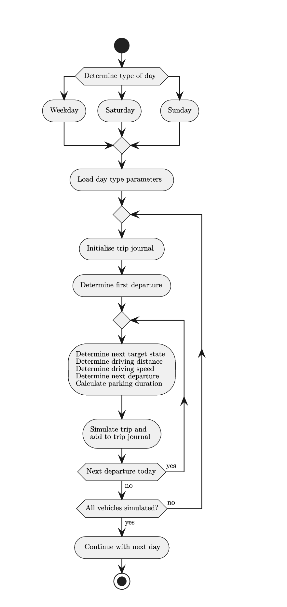
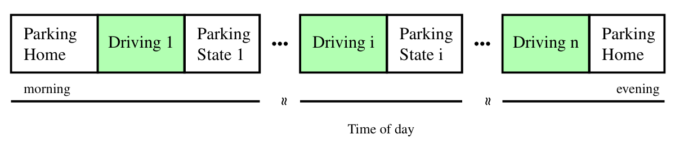

# About MobilitySimulator

The MobilitySimulator is a simulation tool for modelling vehicle mobility behaviour. MobilitySimulator is being developed
at the [Institute of Energy Systems, Energy Efficiency and Energy Economics](https://ie3.etit.tu-dortmund.de) at
[TU Dortmund University](https://www.tu-dortmund.de), Germany. The increasing adoption of electric vehicles introduces 
additional challenges for power system analysis and grid planning, particularly due to new spatial and temporal charging demands. 
This challenge is addressed by introducing a simulation environment which simulates electric vehicle driving trips to model 
realistic driving behaviours.

## Methodology

The main goal of MobilitySimulator is to estimate when and where electric vehicles require charging, as well as how many vehicles
will require charging at any given time and location. When it is further run in conjunction with [SIMONA](https://simona.readthedocs.io/en/latest/), 
it supports modelling charging demands, optimising grid investments, and evaluating smart charging strategies to mitigate negative grid effects and enhance 
renewable integration. It uses novel approaches for simulating driving trips of electric vehicles at a large scale in co-simulation with an energy simulation 
framework linking the EVs with the grid-connected charging stations, enabling analysis of their impact.

Through the mobility simulator, empirical vehicle mobility patterns are incorporated in the simulation environment. Additionally, by integrating 
it with SIMONA the setup can further facilitate co-simulation with the electric power system, that allows power
flow calculations and load management strategies.

The trip data used as the basis for the trip modelling originates from mobility studies such as Mobilität in Deutschland (MiD) and can also be obtained from other comparable datasets. 
These datasets consist of a set of trips $f_i \in F$. Based on this set $F$ new trips are generated by from the trip simulation, which collectively 
represent the traffic patterns. This allows the creation of a realistic usage profile for e-mobility. The trip set $F$ is sorted by vehicle
type first and chronologically second (as described by the trip counter $i$), with trips $f_i$ represented as tuples of the parameters.

The figure above shows the methodology used for generating and simulating trip parameters using Monte Carlo Approach.
Initially, the type of day used for simulation is determined along with vehicle travel journals will
be simulated. Depending on whether it is a weekday or a weekend, the appropriate simulation parameters are loaded,
since the driving behaviour varies between weekdays and weekends. The simulation starts with initialising a travel journal for the
trips of one day. Key trip information such as departure time, destination, and distance are generated sequentially. The average speed 
is then used to calculate travel duration and arrival time for the next destination. After determining how long the
vehicle stays at the destination, it will be checked if the day has passed after this duration. If not, the next trip is simulated
based on the updated departure time until the final trip of the day has been simulated.

The above figure shows the structure of trip journal that is modelled for the simulation which is based on vehicle journeys.
Trip origins and destinations are categorised according to their purpose which helps with better understanding different mobility 
patterns based on varying scenarios.

A complete trip of the vehicle is described using the set of following parameters $f_i \in F$, where $F$ is trip set and 
$f_i$ is tuples of the parameters. The parameters used along with their units in brackets are given below:
1. $w_i$ Daytype
2. $a_i$ Departure time [min] (sincedaystart)
3. $z_{i−1}$ Previous state
4. $z_i$ Target state
5. $d_i$ Travel distance [$\mathrm{km}$]
6. $v_i$ Average driving speed [$\mathrm{km\,h^{-1}}$]
7. $g_i$ Travel time [min]
8. $b_i$ Arrival time [min] (sincedaystart)
9. $u_i$ Arrival time interval
10. $s_i$ Parking duration [min]
11. $a_i$ Counter of drives

The detailed description of the paraameters used in set $F$ is given here:

**Departure Time:** Each individual trip $f_i$ starts within the previous state $z_{i-1}$.  
The first starting state of a day always begins in the state *home*. To determine the next vehicle departure, 
a distinction is made between the first departure of the day and all subsequent departures.

For the first departure of each day, a random departure time is drawn such that all first departures match 
the distribution of the base data. For all subsequent departures, the departure time results from adding the 
arrival time and the parking duration from the last trip.

$a_i$ = $b_{i-1}$ + $s_{i-1}$

**Starting and Target State**: The destination of each trip is determined using transition probabilities 
based on the concept of Markov chains. Possible states include *Home*, *Workplace*, 
*Grocery Shopping and Errands*, *Leisure*, and *Other*.

The probability of moving from a previous state to a target state depends on the time of departure. 
Since daily mobility patterns change throughout the day, the probabilities are calculated 
for 96 time intervals of 15 minutes each.

**Trip Distance:** The travel distance $d_i$ of a trip depends on the previous state $z_{i-1}$ and the destination state $z_i$, 
since different trip purposes typically result in different travel distances. Additionally, the distance 
is influenced by the departure time $a_i$, as mobility patterns vary throughout the day.

**Average Driving Speed:** The average driving speed is used to estimate the duration of a journey. It depends on both the travel distance
and the time of the trip. Longer journeys often include faster roads, leading to higher average speeds, while the time of day influences speed 
due to varying traffic conditions.

The mean average driving speeds are analysed as a function of the travel distance. The calculation considers distances in the range $d \in [0,150]$ km. 
In general, the average speed increases with increasing travel distance. For different times of day $\tau_j$, the relationship between distance and speed 
follows a logarithmic trend. Therefore, regression analysis is used to determine the optimal parameters $a_{\tau_j}$ and $b_{\tau_j}$ of the function

$\rho_{\tau_j}(d)$ = $a_{\tau_j}$ + $b_{\tau_j}$ $\cdot$ $\log(d)$.

The function $\rho_{\tau_j}(d)$ is adjusted using the Newton–Gauss method.

**Arrival Time and Parking Duration:** The trip duration is calculated based on the travel distance and the average driving speed, which determines the arrival time. 
The parking duration represents how long a vehicle remains at its destination and is based on 15‑minute arrival intervals.

For trips that end at the place of residence, stops are classified as either intermediate or final. Intermediate stops are followed by additional trips during the same day, 
while final stops mark the end of the daily travel sequence. A probability‑based decision mechanism derived from arrival intervals is used to determine whether a stop is 
intermediate or final.

## Integrating with Simona

The mobility simulator is further integrated with Simona environment for efficient co-simulation. This allows interaction with the energy system
and the use of functionalities such as power flow calculation, energy management control and other time series-based planning functionalities. 
To achieve that, SIMONA provides an API to interact with an external simulation that handles the communication and data transfer between both simulations.
The simona API can be accessed [here](https://github.com/ie3-institute/simonaAPI) for the further information.

Therefore, by modeling realistic mobility behaviours, assigning probabilistic destinations, and integrating charging processes, the approach enables
detailed analyses of energy demands arising from EVs.

## Further Information and Contact Details

Please, visit the SIMONA [website](https://simona.ie3.e-technik.tu-dortmund.de) for further Information. There you will
also find the current developers' contact information which are also responsible for the MobilitySimulator.
